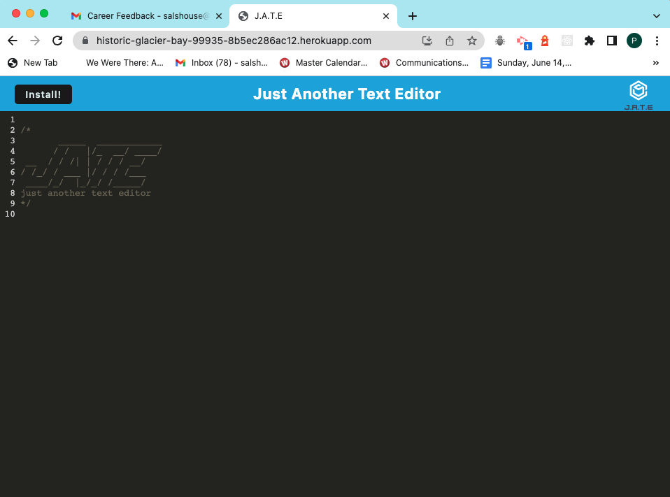
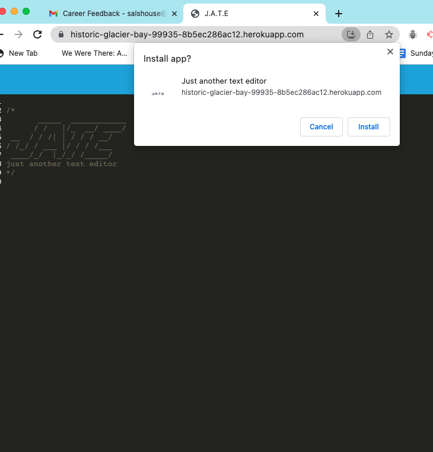
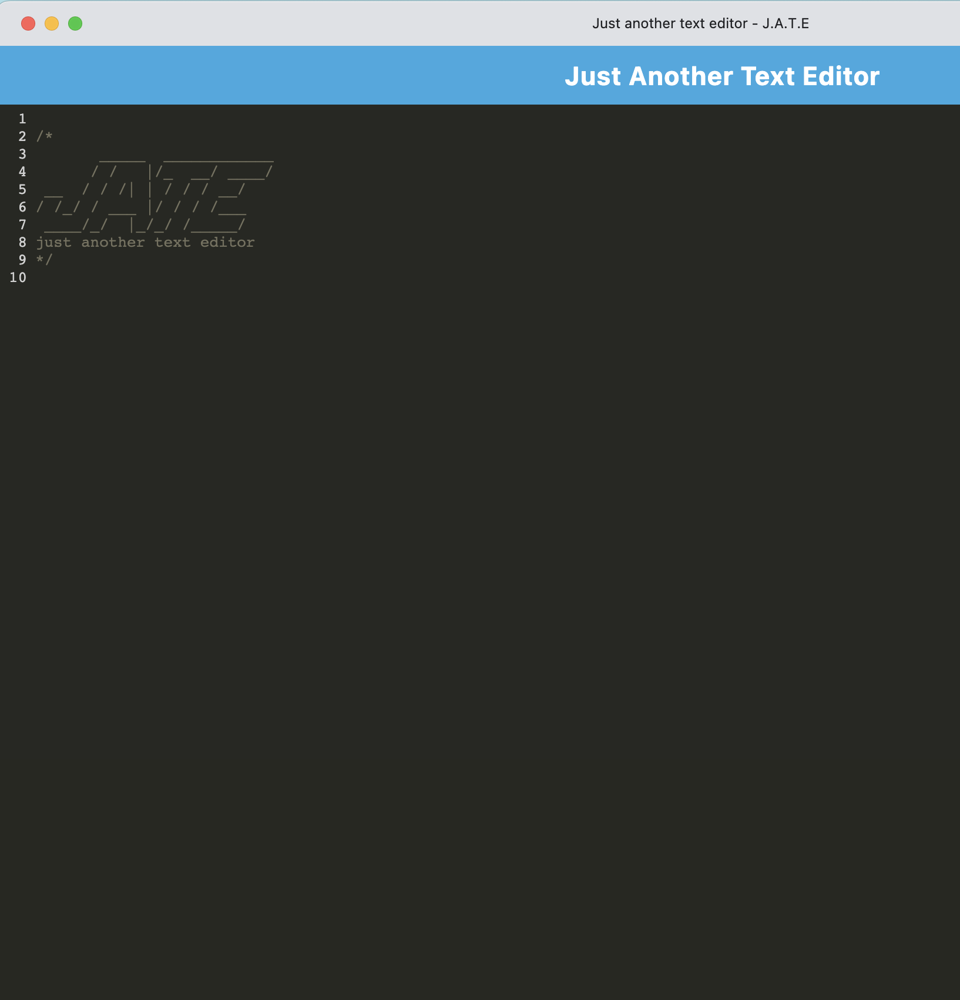
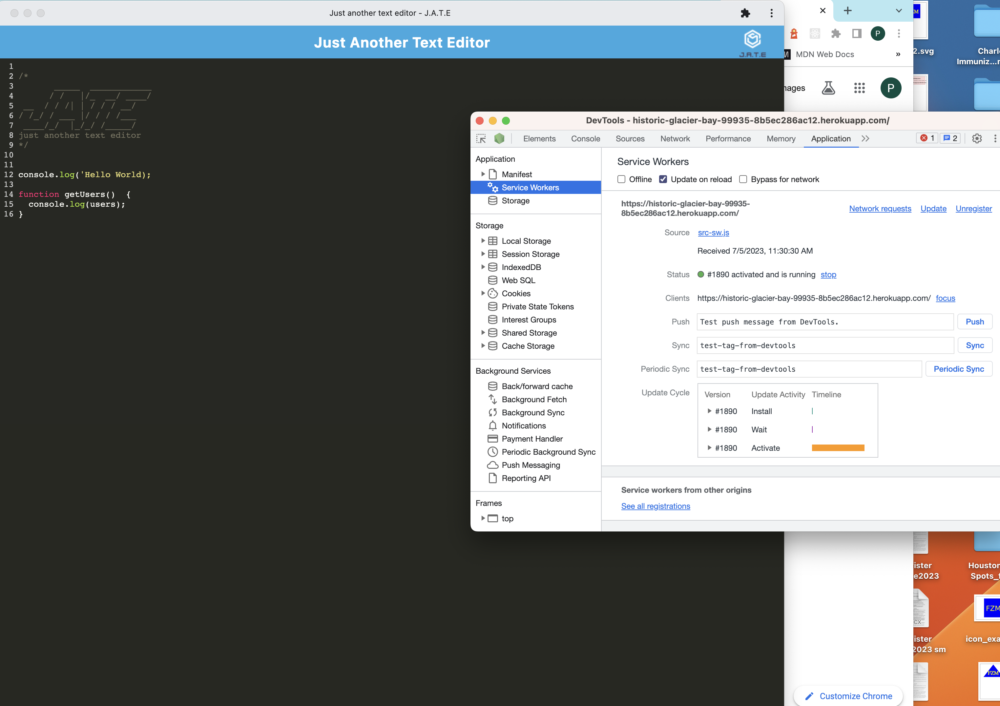
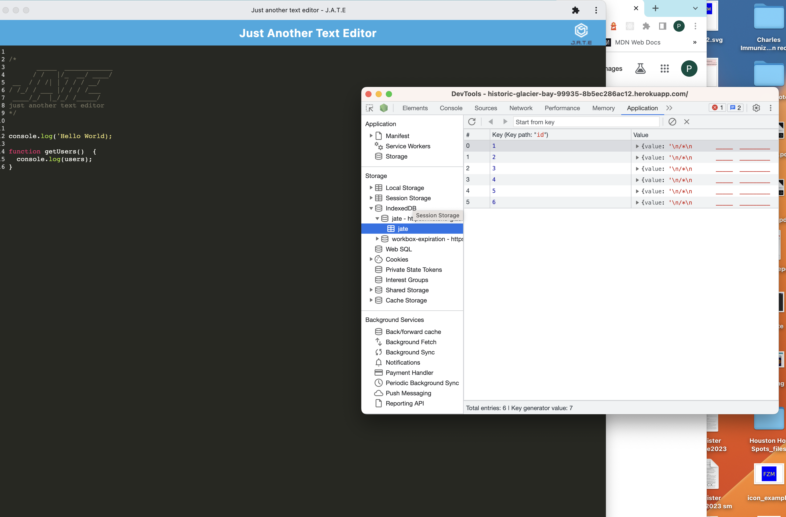

# PWA-text-editor

---

## Badges

---

## Table of Contents

---

- [Description](#description)
- [Usage](#usage)
- [Installation](#installation)
- [Contributing](#contributing)
- [Questions](#questions)
- [License](#license)

## Description

---

This application is a text editor that runs in the browser. It uses data persistance technology and index db that allows it to store data in the users storage so that it can operate offline.

## Usage

---

You can use the app from the browser or install it as an app. You can write notes and/or code snippets that will save even when offline

## Installation

---

Visit the website URL: https://historic-glacier-bay-99935-8b5ec286ac12.herokuapp.com/ and click the install button to install the app as a Progressive Web Application. You can also clone or fork this repo and run `npm i` to install node dependencies and `npm start` to start the program locally.

## Credits

---

This app was an assignment from the Rice University Fullstack Bootcamp. The starter code was provided and I added functionality to make it a PWA

## Tests

---

There are no tests provided for this applcation

## Contact Information

---

### Github: [Phillip Pfister](https://github.com/Phil-Pfister)

### Email: salshouse@gmail.com

### URL: https://historic-glacier-bay-99935-8b5ec286ac12.herokuapp.com/

## License

---

This application uses the The Unlicense license
